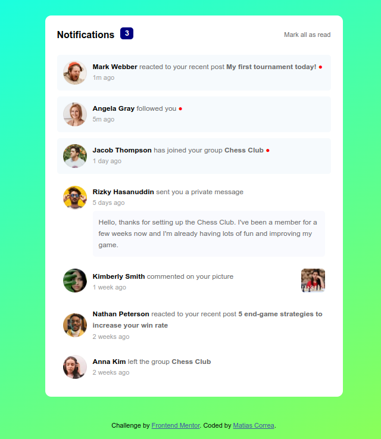

# Frontend Mentor - Notifications page solution

This is a solution to the [Notifications page challenge on Frontend Mentor](https://www.frontendmentor.io/challenges/notifications-page-DqK5QAmKbC). Frontend Mentor challenges help you improve your coding skills by building realistic projects. 

## Table of contents

- [Overview](#overview)
  - [The challenge](#the-challenge)
  - [Screenshot](#screenshot)
  - [Links](#links)
- [My process](#my-process)
  - [Built with](#built-with)
  - [What I learned](#what-i-learned)
  - [Continued development](#continued-development)
- [Author](#author)

## Overview

### The challenge

Users should be able to:

- Distinguish between "unread" and "read" notifications
- Select "Mark all as read" to toggle the visual state of the unread notifications and set the number of unread messages to zero
- View the optimal layout for the interface depending on their device's screen size
- See hover and focus states for all interactive elements on the page

### Screenshot




### Links

- Solution URL: [Notifications Page](https://github.com/devmatias/challenges-frontend/tree/main/notifications-page-main)

## My process

### Built with

- Semantic HTML5 markup
- CSS custom properties
- SASS compiler
- Flexbox
- CSS Grid
- Desktop-first workflow
- JavaScript

### What I learned

I practiced using SASS compiler using SCSS files, some basic HTML and some JS.

```css
.container {
    display: grid;
    grid-auto-rows: auto;
    row-gap: 1rem;

    @media only screen and (max-width: 500px) {
        margin: 0;
        border-radius: 0;
    }
}
```
```js
const getMarkAsRead = document.querySelector('.header__mark-as-read');
const getNotifications = document.querySelectorAll('.notifications');
const getPopUpNotifications = document.querySelector('.header__text-1').querySelector('span');

const markAllAsRead = () => {
    getMarkAsRead.addEventListener('click', () => {
        getPopUpNotifications.style.display = 'none';
        getNotifications.forEach((notification) => {
            notification.classList.remove('notifications__not-read')
            notification.querySelector('span').style.display = "none";
        })
    })
}
```

### Continued development

This project was just an exercise for more complex projects in the future, I will not take it further along.

## Author

- Frontend Mentor - [@devmatias](https://www.frontendmentor.io/profile/devmatias)

## Installation

If you want to download the project and see it for yourself. 
In your terminal use:

```bash
npm install
```

Now you will be able to run this project on your machine.
